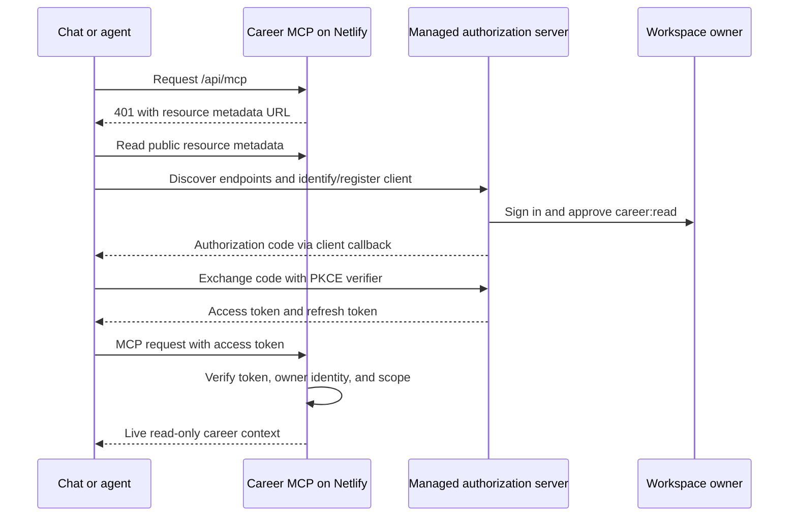

# MCP OAuth implementation plan

> **Status (2026-09-26):** historical. MCP is now served by the Go server with built-in single-owner OAuth; see [README.md](README.md).

Status: application implementation and local OAuth integration tests completed; live managed-provider qualification, hosted client testing, and deployment remain pending provider/account and owner configuration. See `README.md` for the implemented configuration and validation checklist. This document preserves the original implementation plan.

Replace the shared MCP credential with browser authorization and renewable, individually revocable client grants. Keep `https://YOUR-SITE/api/mcp` as the canonical endpoint and retain the existing read-only tools and live workspace behavior.

The compatibility target is any client supporting MCP Streamable HTTP and standard OAuth, plus an OAuth-capable bridge for local stdio clients. OAuth cannot add MCP support to a chat product that lacks it, bypass workspace administrator restrictions, or automatically share a connection across unrelated products. Each client needs its own initial connection and authorization.

**Recommended architecture:** retain Astro/Netlify as the resource server and use a managed MCP-compatible authorization server for login, consent, registration, token issuance, refresh, and revocation. Authorize only the workspace owner and explicitly enrolled service identities.



**Current project constraints**

| Location | Finding and planned change |
| --- | --- |
| `src/lib/mcp-http.ts` | Currently requires `CAREER_MCP_TOKEN`; replace this gate with OAuth access-token verification and discovery challenges. Preserve body limits and stateless request handling. |
| `src/pages/api/mcp.ts` | Keep the endpoint and workspace reader; authenticate before any workspace read. |
| `src/middleware.ts` | Only `/api/mcp` bypasses website authentication today. Explicitly allow public OAuth metadata routes so discovery receives JSON instead of a login redirect. |
| `src/lib/workspace-server.ts` | Reads one shared personal workspace. A valid identity-provider account alone must never grant access. |
| `src/lib/server-auth.ts` and `netlify/functions/auth.js` | Website login uses a separate cookie/JWT system. MCP access tokens must remain separate from website editing credentials. |
| `scripts/career-mcp.mjs` | Currently forwards a static token. Add OAuth login and renewable credential storage using the installed SDK's `OAuthClientProvider` support. |
| `public/sw.js` | Currently caches an explicit public asset list. Keep MCP responses and any local authentication pages outside that cache. |

**1. Qualify and configure the authorization service**

Use a managed service to avoid building authorization-code storage, refresh-token rotation, and registration persistence inside stateless Netlify functions. WorkOS AuthKit is a candidate: its official guide documents MCP OAuth, dynamic client registration, hosted authentication, and an option to bridge existing users. Its suitability for this exact resource/audience and client matrix still needs a staging proof. [WorkOS MCP guide](https://workos.com/blog/how-to-add-authentication-to-your-mcp-server)

The first implementation milestone is a working staging provider configuration. Require:

- Authorization Code with PKCE `S256`, public clients without embedded secrets, and appropriate confidential-client authentication.
- Discovery metadata, resource-bound access tokens, refresh-token rotation, consent, signing-key rotation, and grant revocation.
- Client ID Metadata Documents (CIMD), Dynamic Client Registration (DCR), and manually registered clients for broad interoperability. The core MCP specification recommends CIMD and makes DCR optional; this project deliberately targets both. [MCP authorization](https://modelcontextprotocol.io/specification/2025-11-25/basic/authorization)
- Exact hosted callback validation and standards-compatible loopback callbacks for CLI clients. No arbitrary wildcard web redirects.
- Explicit owner restriction and, for unattended workloads, separately registered service clients.

Prove resource-specific audience binding with an issued token; do not copy a provider tutorial's project-wide audience without checking what other tokens could satisfy it. Also prove that CIMD/DCR, custom scopes, refresh, and machine clients are available in the selected service configuration. If the candidate fails a required capability, choose another managed authorization service before integrating it into the application. Record the selected provider, account tier/cost, issuer, claim mapping, and callback policy as the output of this milestone.

Default to provider-hosted login for MCP and bind its immutable `(issuer, subject)` to the existing workspace owner. The website can retain its current login. Reusing website sign-in through a provider bridge is an optional later convenience.

**2. Add public discovery and explicit configuration**

Proposed application settings:

| Setting | Purpose |
| --- | --- |
| `CAREER_MCP_AUTH_MODE` | Explicit `disabled`, `oauth`, or temporary `legacy` mode; no silent fallback. |
| `CAREER_MCP_RESOURCE` | Canonical production HTTPS endpoint, including `/api/mcp`. |
| `CAREER_MCP_OAUTH_ISSUER` | Trusted provider issuer. |
| `CAREER_MCP_OAUTH_AUDIENCE` | Expected MCP-specific audience, preferably identical to the resource URI. |
| `CAREER_MCP_OWNER_SUBJECT` | Immutable allowed owner subject under that issuer. |
| `CAREER_MCP_ALLOWED_ORIGINS` | Exact origins permitted for direct browser MCP clients. |

Keep provider management secrets in server-side environment settings only when needed. Obtain signing keys from the configured issuer's trusted metadata/JWKS location, never from a token-supplied URL. Separate production and staging issuers/resources and workspace data.

Serve both `/.well-known/oauth-protected-resource/api/mcp` and the root fallback `/.well-known/oauth-protected-resource` as public JSON with the same document:

```json
{
  "resource": "https://YOUR-SITE/api/mcp",
  "authorization_servers": ["https://YOUR-AUTH-ISSUER"],
  "scopes_supported": ["career:read"],
  "bearer_methods_supported": ["header"]
}
```

Missing credentials should return HTTP 401 with:

```http
WWW-Authenticate: Bearer resource_metadata="https://YOUR-SITE/.well-known/oauth-protected-resource/api/mcp", scope="career:read"
```

The provider hosts authorization-server metadata and OAuth endpoints on its issuer domain. No local `/authorize` or `/token` implementation is needed with hosted login. Public metadata must be reachable without website cookies, including through Netlify routing. Use the configured canonical resource, not an untrusted incoming Host header. [MCP discovery requirements](https://modelcontextprotocol.io/specification/2025-11-25/basic/authorization)

**3. Enforce access before reading the workspace**

Create `src/lib/mcp-auth.ts` with a verifier that can be injected into HTTP tests. Use a maintained JWT/JWKS verifier for a JWT provider, or authenticated introspection if the selected provider issues opaque tokens.

Application policy:

- Validate signature, pinned issuer, MCP audience, expiry, applicable not-before/token-type claims, and `career:read` scope. Reject ID tokens and website JWTs.
- Require the configured owner subject for delegated access. For machine access, require an explicitly enrolled service identity mapped to this workspace. Scope alone is insufficient.
- Use HTTP 401 for missing/invalid/expired access tokens; use 403 for insufficient scope or a disallowed identity. Include the appropriate OAuth challenge without exposing personal data.
- Fail closed when configuration, key retrieval, or required authorization checks fail. Cache trusted signing keys with bounded refresh and key-rotation handling.
- Propose 10-minute access tokens and rotating refresh tokens with a 30-day idle expiry, subject to provider support. Document actual configured lifetimes.
- Revoking a grant must stop refresh. With local JWT verification, previously issued access tokens may remain valid until expiry; document that bound. Use introspection or a durable grant denylist if immediate per-client revocation is required.
- Log request IDs, client identifiers where available, outcome, and tool name; redact tokens and career content.

Start with one `career:read` scope covering all currently exposed content. Consent must plainly mention work and personal journals, biography, contacts, and supporting documents. Granular collection scopes would require changes throughout overview, listing, search, reads, resources, and prompts; defer them as a separate feature.

**4. Preserve transport compatibility and add browser support**

Keep stateless Streamable HTTP with JSON responses. Retain authenticated GET/DELETE 405 behavior unless a tested target client demonstrates a transport requirement; OAuth itself does not require persistent SSE sessions.

For direct browser clients, add unauthenticated OPTIONS handling before bearer validation, exact origin validation, and CORS response headers on success and errors. Allow needed MCP headers such as `Authorization`, `Content-Type`, `Accept`, and `MCP-Protocol-Version`; expose `WWW-Authenticate`. Include `Vary: Origin` for origin-dependent responses. Require a bearer token on actual MCP requests and do not enable cookie credentials. Provider metadata/token endpoints also need browser compatibility when the client exchanges tokens in the browser.

Allow requests without an Origin header from hosted servers and CLI clients; reject unapproved supplied origins. Keep the existing 64 KiB body limit and private/no-store MCP responses. Test Netlify's deployed routing and OPTIONS handling, not just the handler in isolation.

**5. Cover interactive clients, local bridges, and unattended agents**

The following is a target validation matrix, not a claim that this unimplemented server has already passed:

| Client category | Connection and validation target |
| --- | --- |
| ChatGPT | Add the remote MCP through the account's supported MCP/plugin management flow; complete OAuth; verify tool discovery and invocation. Copy the exact callback displayed by the product. |
| Codex | Configure `[mcp_servers.career]` with the remote `url`; run `codex mcp login career`; verify reconnect and token refresh. |
| Claude web/desktop | Add a remote custom connector and authorize; test access in a new conversation. |
| Claude Code | Configure the remote HTTP server and authenticate using `/mcp`. |
| Gemini CLI | Configure remote MCP and use OAuth discovery or `/mcp auth`; verify its callback and refresh behavior. |
| Cursor and other MCP IDEs | Test their installed version's remote OAuth flow; use the local bridge where direct compatibility fails and stdio is supported. |
| Local stdio-only clients | Run the upgraded project bridge; it handles OAuth on its remote HTTP connection. |
| Custom API agents | The application's credential manager obtains/renews OAuth tokens and supplies them to the remote MCP integration. |
| Unattended jobs | Use a separately enrolled confidential client with Client Credentials, or an owner-approved persisted refresh grant when acting on the owner's behalf. |

OpenAI documents CIMD, DCR, predefined clients, and PKCE. Advertise `S256`; use the exact product-provided redirect, whose form depends on issuer-identification support. Keep client registrations stable while connections remain active. OAuth setup does not automatically publish or install a plugin. [OpenAI authentication](https://developers.openai.com/plugins/build/auth)

Codex supports remote OAuth and explicit login. Claude exposes remote connector authorization and Claude Code supports OAuth. Gemini CLI documents discovery, registration, and browser login. Account policy and installed versions still require actual verification. [Codex MCP](https://learn.chatgpt.com/docs/extend/mcp?surface=cli), [Claude connectors](https://support.claude.com/en/articles/11175166-get-started-with-custom-connectors-using-remote-mcp), [Claude Code MCP](https://code.claude.com/docs/en/mcp), [Gemini CLI MCP](https://geminicli.com/docs/tools/mcp-server/)

Upgrade the bridge with explicit `login`/`logout` commands, SDK OAuth handling, a loopback callback, state/issuer validation, and secure credential persistence keyed by issuer/resource/client. Prefer an OS credential store; any file fallback must be owner-readable only. Serialize refresh across processes so rotating credentials are not raced. Interactive prompts go to stderr; stdout remains MCP messages. Retain HTTPS and redirect protections. A one-time login must precede unattended bridge use; an expired/revoked refresh grant must produce an actionable reauthorization error.

Machine clients receive independent credentials and `career:read` authorization; dynamic registration must not automatically grant machine access. Client Credentials is an MCP authorization extension, not a universal chat-client feature. Such agents request a new short-lived access token when needed; they normally do not use refresh tokens. [MCP Client Credentials extension](https://modelcontextprotocol.io/extensions/auth/oauth-client-credentials)

**6. Verify and roll out**

Extend `tests/mcp.test.ts` and add focused auth tests for valid access, wrong issuer/audience/subject, missing scope, expired tokens, ID-token rejection, key rotation, unavailable authorization dependencies, discovery, CORS, and credential separation. Assert that rejected requests never invoke the workspace reader.

Extend `tests/mcp.integration.mjs` to exercise real Astro routing against a local test authorization server: discovery → registration → PKCE authorization → token exchange → MCP read → refresh. Cover consent denial, mismatched callbacks/state, code replay, wrong PKCE verifier, refresh replay, revocation behavior, and stdio reconnect. Provider-managed behavior must also be checked in staging rather than inferred from the test double.

Run `npm test`, `node tests/mcp.integration.mjs`, `npm run tc`, `npm run build`, and `npm run check:netlify-build` after implementation. Then run the client matrix against a stable HTTPS staging endpoint with synthetic personal data. Record client version/date, registration method, first login, all four tool calls, refresh, reconnect, and revocation result. Test resources/prompts where the client supports them.

Deploy production OAuth configuration after staging passes. Connect clients individually, update `README.md` and its README reference with exact provider setup and connection instructions, then remove `CAREER_MCP_TOKEN` and static-token examples. If migration requires legacy access, make it an explicit temporary mode; never silently accept the old token when OAuth verification fails. Rollback should disable MCP or deliberately select the previous secured configuration.

Completion means every target client has a recorded working OAuth path, unattended credentials renew correctly, unrelated identities cannot read the shared workspace, grants can be revoked with a documented access-token expiry bound, and production no longer depends on the shared MCP token.

Implementation inputs to settle during milestone 1: canonical production hostname, managed provider/account, immutable owner identity, available target client accounts, and which unattended jobs need separate service identities. These are setup dependencies; they do not prevent preparing this plan.
